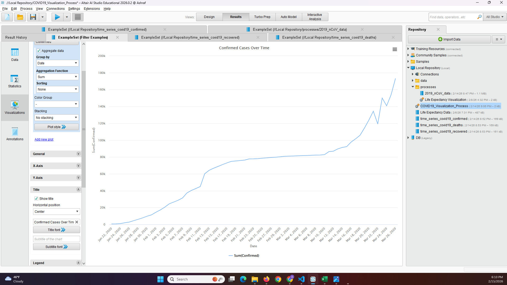
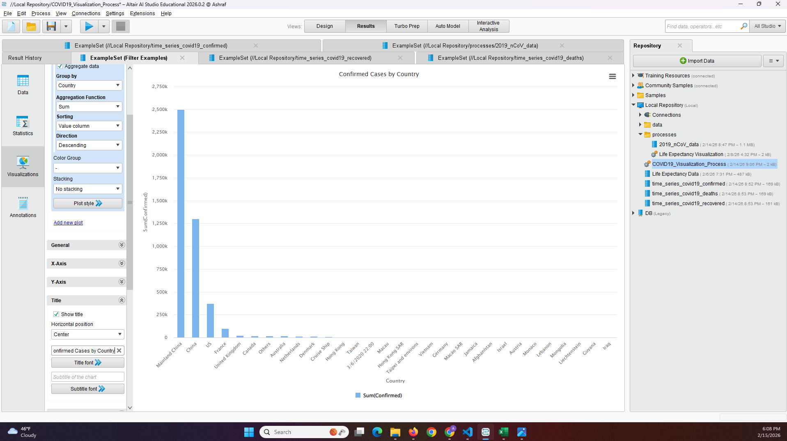
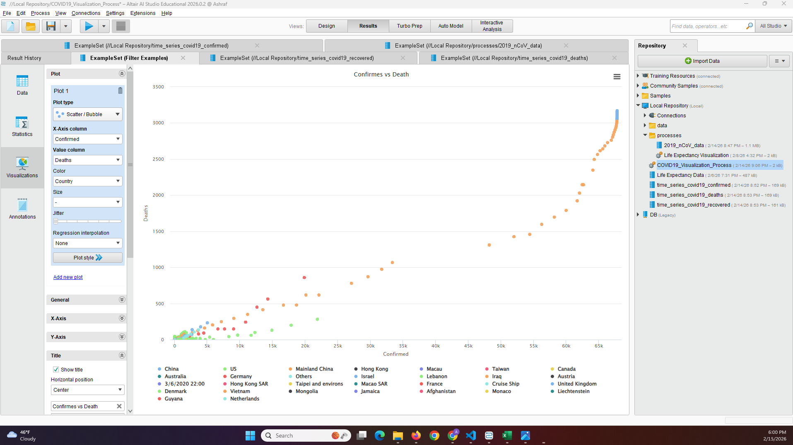
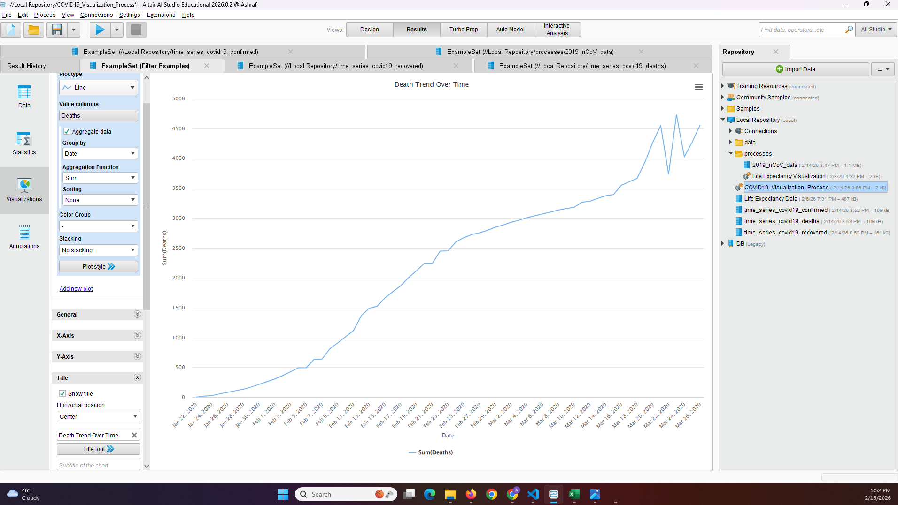
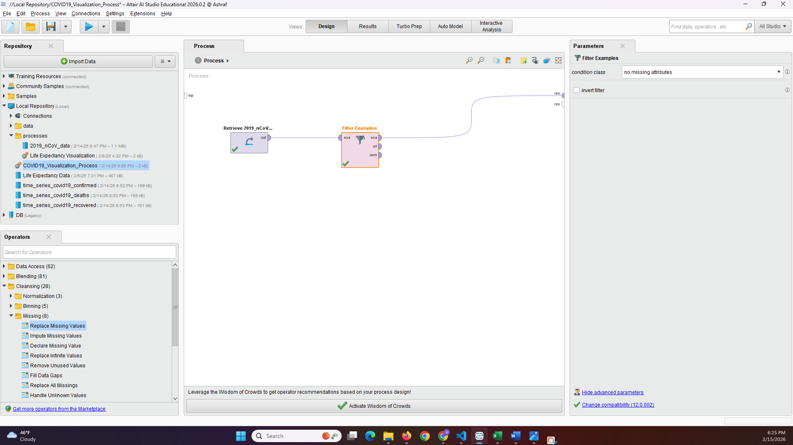

# COVID-19 Data Visualization using RapidMiner

## Overview
This project analyzes the global spread and impact of the **COVID-19 pandemic** using data visualization techniques in **Altair AI Studio (RapidMiner)**. The dataset used in this project was obtained from **Kaggle** and includes confirmed cases, deaths, and recovery statistics across different countries and time periods.

The goal of this project is to explore patterns in COVID-19 data and understand how the pandemic evolved globally. Several visualizations were created to examine relationships between confirmed cases, deaths, and recoveries.

---

## Dataset
The dataset was downloaded from **Kaggle COVID-19 data sources** and includes the following files https://www.kaggle.com/code/rpsuraj/covid-19-comprehensive-data-visualization/data
- `2019_nCoV_data.csv`
- `time_series_covid19_confirmed.xlsx`
- `time_series_covid19_deaths.xlsx`
- `time_series_covid19_recovered.xlsx`

These datasets contain time-series information about the number of confirmed cases, deaths, and recoveries reported in different countries.

---

## Data Preparation
The dataset was imported into **RapidMiner Studio** for preprocessing and analysis. Before generating visualizations, the data was checked for missing values to ensure accurate results.

The following steps were performed:

1. The dataset was retrieved using the **Retrieve operator**.
2. Missing values were identified using the **Declare Missing Values operator**.
3. Incomplete records were removed using the **Filter Examples operator** with the condition:

```
no_missing_attributes
```

This preprocessing step ensured that only complete observations were used for visualization and analysis.

---

## Visualizations

### Confirmed Cases Over Time
This visualization shows the trend of confirmed COVID-19 cases over time, highlighting the rapid spread of the virus during the pandemic.



---

### Confirmed Cases by Country
This chart compares the number of confirmed cases across different countries, revealing which regions were most heavily affected.



---

### Confirmed Cases vs Deaths
This scatter plot illustrates the relationship between confirmed cases and the number of deaths, showing how increases in infections correspond to higher mortality levels.



---

### Death Trend Over Time
This visualization tracks the progression of COVID-19 deaths over time, helping illustrate the severity of the pandemic during peak periods.



---

### Recovery Trend Over Time
This chart shows recovery trends throughout the pandemic and helps highlight improvements in treatment and healthcare response over time.


---

## RapidMiner Workflow
The following workflow was used to retrieve the dataset, identify missing values, and remove incomplete records before creating the visualizations.



---

## Key Insights
The visualizations reveal several important insights about the COVID-19 pandemic:

- Confirmed COVID-19 cases increased rapidly during the early stages of the pandemic.
- Countries with higher numbers of confirmed cases generally experienced higher death counts.
- Death trends followed similar patterns to confirmed case trends, particularly during major outbreak periods.
- Recovery rates increased over time as healthcare systems improved their response to the pandemic.
- Data visualization helps identify global patterns and provides valuable insights into the progression and impact of infectious diseases.

---

## Tools Used
- Altair AI Studio (RapidMiner)
- Data Visualization
- Data Cleaning
- Exploratory Data Analysis

---

## Project Structure
```
covid19-rapidminer-analysis
│
├── data
│   ├── 2019_nCoV_data.csv
│   ├── time_series_covid19_confirmed.xlsx
│   ├── time_series_covid19_deaths.xlsx
│   └── time_series_covid19_recovered.xlsx
│
├── rapidminer-process
│   └── workflow.png
│
├── visualizations
│   ├── ConfirmedCasesOverTime.png
│   ├── ConfirmedCasesbyCountry.png
│   ├── ConfirmedvsDeath.png
│   ├── DeathTrendOverTime.png
│   └── RecoveryTrendOvertime.png
│
└── README.md
```

---

## Project Purpose
This project demonstrates how **data visualization techniques can be used to analyze pandemic data and identify important trends in global health events**. The analysis highlights how visual analytics tools such as RapidMiner can help researchers and policymakers better understand disease spread and healthcare outcomes.
